# Welcome to my first Program: Kto12 Grading Calculator 👋

- **Developed:** 2023
- **Purpose:** Partial fulfillment for the subject Computer Programming 2
- **Application Type:** Console-based application (Terminal, no GUI)
- **Platform:** Windows 7/8/8.1/10/11

## Get started

1.  Install GCC Compiler
    - To install GCC compiler in Windows, you can use choco (install it first)
        https://chocolatey.org/install

    ```PowerShell
     choco install mingw
    ```

2.  Clone this repo
    You may clone this repo in VSCode or any IDE you want.

3.  build the app using this command

    ```bash
     gcc main.c -o kto12
    ```

    here main.c is the source file and kto12 as the output (you may run the output)

## Documentation

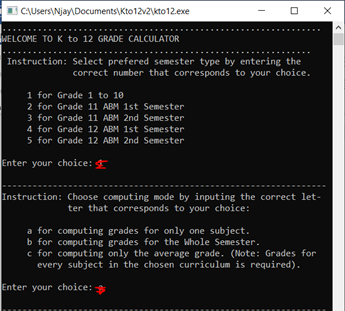
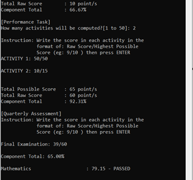
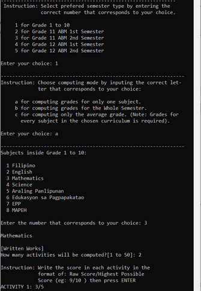
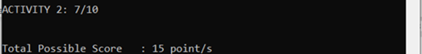
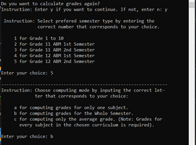
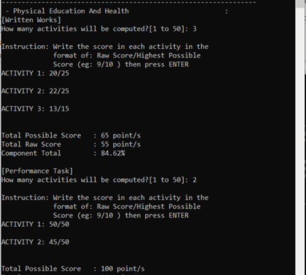
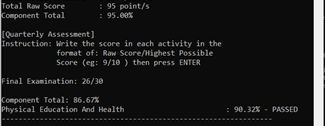
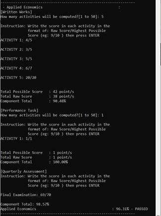
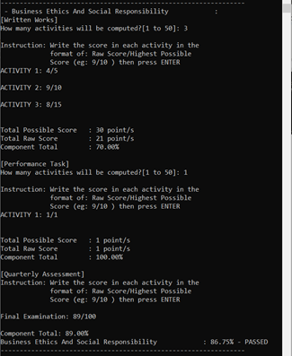
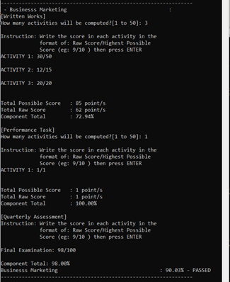
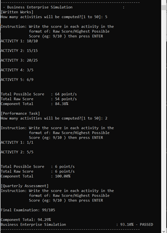
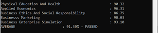
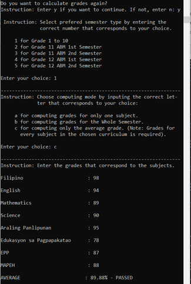
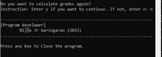

## Troubleshoot

Since conio.h reference is included in the project, current gcc version may not support it. you may:
1. Delete all association of conio.h in the source code to run.
2. Find and install the version of GCC that supports conio.h.
3. Do whatever you want.

## Learn C

To get started learning C, look at the following resources:

1.  Fireship.io C Programming in 100 seconds
    https://www.youtube.com/watch?v=U3aXWizDbQ4

2.  Programiz C Programming for Beginners Playlist
    https://www.youtube.com/playlist?list=PL98qAXLA6aftD9ZlnjpLhdQAOFI8xIB6e

3.  W3School C Tutorial
    https://www.w3schools.com/c/

## Want to talk to me?

1.  Facebook : Jr Garingarao
    https://www.facebook.com/nigel.garingarao

2.  Telegram : Jr Garingarao
    telegram.me/Jr_Garingarao
